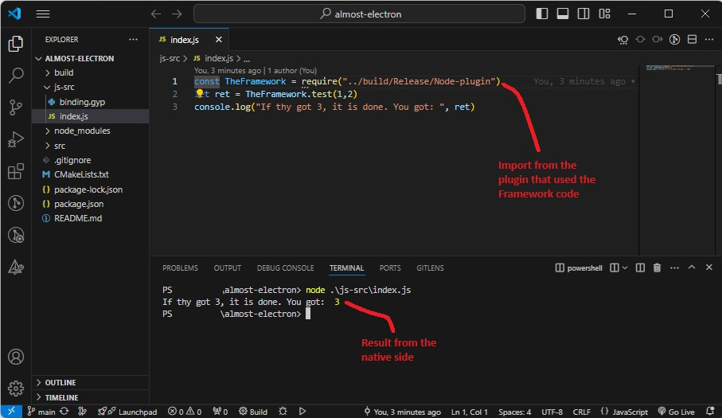

# ALMOST ELECTRONJS but NOT!
This repo contains a poc of somekind which is 'fw&app' that resembles Electron.  

## What it is not
Fully featured  
Bug free (;D)

## Description of the project
CMake as build system/generator with npm  
NodeJS NAPI  
Uses C++ Library containing some sample stuff  
'Windows' only implementation  
Uses javascript as a 'client'  

  

  

## How to run
npm install  
node js-src/index.js  

## Whats next
Interface with JS?  

## Development?
I used Visual Studio 2022 for the native parts and VS Code for javascript  
